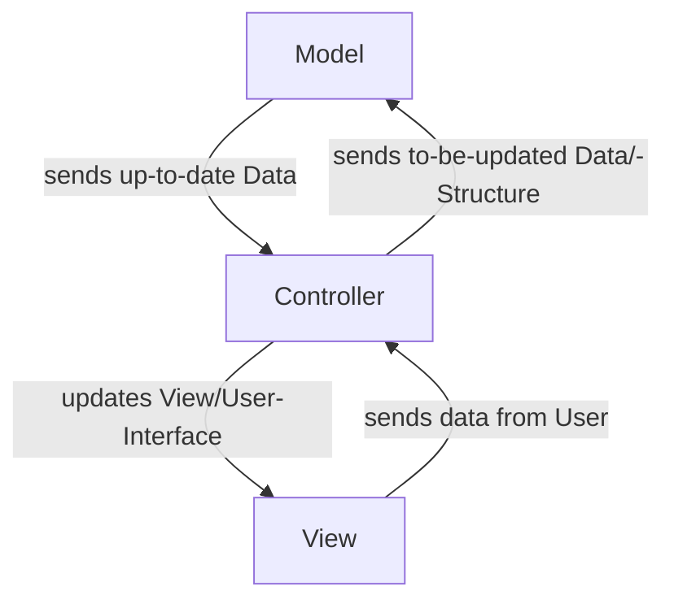

# PHP-MVC

Model
: Models can be found in app/models dir.

Controller
: Controllers can be found in app/controllers dir.

View
: Views can be found in resources/views dir.

## Links

[Mozilla](https://developer.mozilla.org/en-US/docs/Glossary/MVC)
